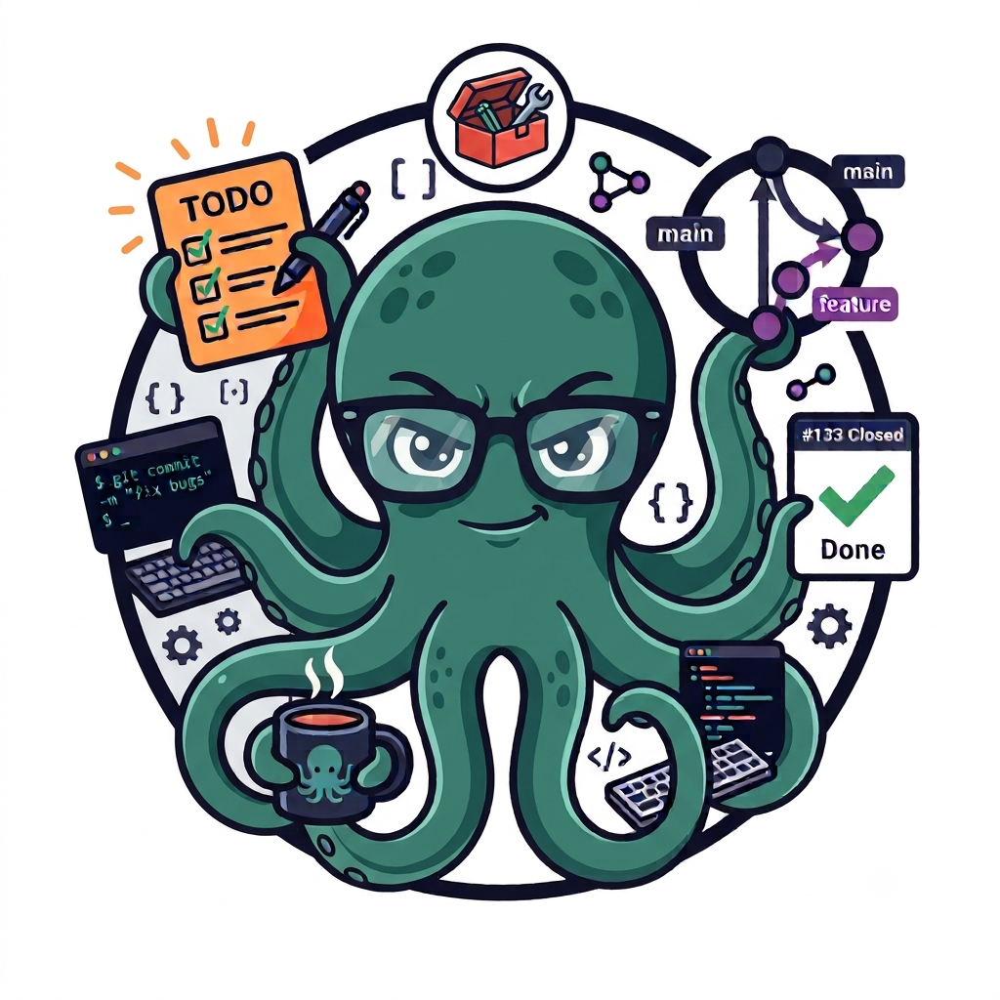
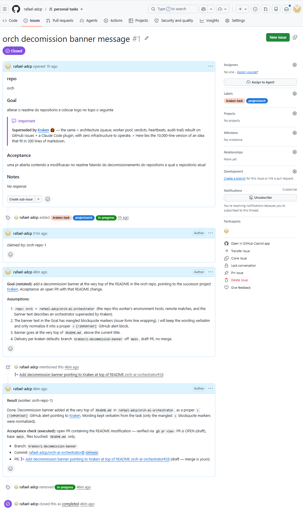

#  Kraken

[](https://github.com/rafael-adcp/kraken/releases)
[](LICENSE)

> **TL;DR:** One head, many tentacles — a task queue built on **GitHub Issues** where
> named Claude Code workers claim tasks, execute them, and record the evidence.
> Write the list once; the tentacles do the rest.

## Why?

AI coding agents made each change cheap — but you are still the bus between the task
list and the terminals: launching prompts, watching spinners, remembering which window
had which task. Kraken removes you from the loop and replaces infrastructure with
things that already exist:

| Concern            | Kraken's answer                                             |
| ------------------ | ----------------------------------------------------------- |
| Queue & state      | GitHub Issues in a private coordination repo you own        |
| Claiming (no race) | Label + `claimed-by` comment; server-side ordering wins     |
| Dependencies       | Native `blocked-by` relationships — closing a task unblocks |
| Parallelism        | Capacity = how many workers you launch; 1 task per worker   |
| Dead workers       | Heartbeat comments + an hourly reaper workflow              |
| Dashboard          | The GitHub UI — filters, notifications, mobile app          |
| Audit trail        | The issue timeline: who, when, why, validated how           |

Work repos can live **anywhere** (GitHub, GitLab, private servers) — only the
coordination repo needs to be on GitHub, and it holds issues, never code.

## Install (Claude Code plugin)

```
/plugin marketplace add rafael-adcp/kraken
/plugin install kraken@kraken
```

**Requirements**: `git`, and a `gh` CLI from June 2026 or later — the dependency
flags (`--add-blocked-by` / `--blocked-by`) shipped then. Older `gh` still works for
everything else; set dependencies via the Relationships sidebar instead.

## Quickstart

1. **Create the coordination repo** (once):

   ```bash
   gh repo create OWNER/tasks --private --clone && cd tasks
   mkdir -p .github/ISSUE_TEMPLATE .github/workflows
   curl -sL https://raw.githubusercontent.com/rafael-adcp/kraken/main/skills/unleash/task-template.yml -o .github/ISSUE_TEMPLATE/task.yml
   curl -sL https://raw.githubusercontent.com/rafael-adcp/kraken/main/skills/unleash/reclaim-stale.yml -o .github/workflows/reclaim-stale.yml
   git add -A && git commit -m "chore: kraken task template and reaper" && git push

   gh -R OWNER/tasks label create kraken-task
   gh -R OWNER/tasks label create in-progress
   gh -R OWNER/tasks label create needs-decision
   gh -R OWNER/tasks label create awaiting-merge
   gh -R OWNER/tasks label create "project:cup"      # one per project you'll queue
   ```

2. **Queue the work**: one issue per task (goal, acceptance, notes). Every issue
   gets a **`project:<name>` label** (workers are scoped to one project — an
   unlabeled task is invisible to all of them) and dependencies via
   `gh issue edit <n> --add-label "project:cup" --add-blocked-by <m>`.

3. **Unleash the kraken** — one worker per environment you prepared. Capacity is
   decided at launch: every worker takes ONE task at a time, so a project gets
   exactly as much parallelism as the number of workers you point at it.

   ```
   # the dev container that owns the "cup" environment -> one worker
   /kraken:unleash OWNER/tasks --worker-name cup-env --project cup

   # five fully isolated clones of the data project -> five workers
   /kraken:unleash OWNER/tasks --worker-name data-env-1 --project ceres
   /kraken:unleash OWNER/tasks --worker-name data-env-2 --project ceres
   ```

   Workers deliver on **work branches + draft PRs** — never the default branch,
   never a merge. Branches follow each work repo's own naming convention (CI
   pipelines key on those patterns); traceability comes from commit trailers
   (`Kraken-Task: OWNER/work-tasks#12 (worker: ..., kraken@x.y.z)`).

   > [!TIP]
   > Forgot which projects live in the queue? Run
   > `/kraken:identify OWNER/tasks` — it lists the `project:` labels and prints
   > ready-to-paste `/kraken:unleash` lines, one per project.

   > [!IMPORTANT]
   > Workers run unattended: the worker environment's Claude Code settings must
   > allow `git commit`/`git push` without prompting — a permission ask-gate with
   > nobody around stalls the task at delivery time. Merges always stay with you.

4. **Come back to evidence**: an `awaiting-merge` filter = your review queue (each
   task with a result comment and a draft PR), a `needs-decision` filter = your
   decision queue (questions with options + recommendation included). Merging a PR
   closes its task (`Closes` reference) and unblocks the dependents. Nothing merges
   without you.

## The loop (what a worker does, unsupervised)

```
list open kraken-task issues for my project
  skip: blocked-by still open · in-progress · needs-decision · awaiting-merge
        (the last two are waiting on the human)
  → claim: re-check the issue's live labels first (the list may be stale)
      already in-progress/awaiting-merge/needs-decision? → skip, never relabel
      still clear? → label in-progress + comment "claimed-by: data-env-1"
      lost the race? another claim came first → next task
  → hand the claimed task to a FRESH subagent (clean context per task, so the driver
    stays lean over a long drain) — still one task at a time:
      → post ASSUMPTIONS as a comment
          expensive unverifiable assumption? → needs-decision + question
          with options + recommendation → next task, no guessing
      → execute in my environment
          (progress comment every ~2h — the heartbeat that keeps the reaper away)
      → run the ACCEPTANCE for real
      → deliver: push a branch (repo's naming convention) + open a draft PR (never merge)
          commits carry Kraken-Task trailers for traceability
      → result comment + PR link → swap in-progress for awaiting-merge
    subagent returns only {task#, final label, PR url} → driver loops
  → you review & merge → the PR's "Closes" line closes the task
  → closing unblocks dependents → an idle worker picks them up
```

To answer a `needs-decision`: reply on the issue ("option B, go") **and remove the
label** — the task rejoins the queue and whoever claims it inherits the full thread.
Same gesture when a review asks for changes: comment the feedback and remove
`awaiting-merge`. Dead workers are handled server-side: the reaper moves silent
`in-progress` issues to `needs-decision` after 6h.

**Keep it draining.** A single run empties the queue and stops. To keep a worker
picking up tasks you file through the day, have Claude Code re-launch it on a schedule
with `/loop`:

```
/loop 15m /kraken:unleash OWNER/tasks --worker-name cup-env --project cup
```

`/loop` is a Claude Code feature, not part of the worker: it just re-runs the command
every 15 minutes (omit the interval to let it self-pace). Each run is an ordinary
drain — same one task at a time, same claim tiebreaker.

## See it run

A real task's timeline, end to end — claim, restated goal + assumptions, the PR
delivered, the result with the acceptance check executed, and the close:



## Updating

The plugin is pinned to the version in its manifest — pushes to `main` reach nobody
until a release bumps it, so what you run is always a deliberate release. To pick up
a new one:

```
/plugin marketplace update kraken
```

## Docs

The single source of truth for worker behavior is
[`skills/unleash/SKILL.md`](skills/unleash/SKILL.md) — the full protocol: claiming
and its tiebreaker, assumptions, acceptance, heartbeats, and authorization
boundaries.

## Origins

Distilled from [orch-ai-orchestrator](https://github.com/rafael-adcp/orch-ai-orchestrator):
same architecture — queue, worker pool, verdicts, heartbeats, audit trail — but zero
infrastructure to operate. GitHub is the queue, the dashboard, and the log.
