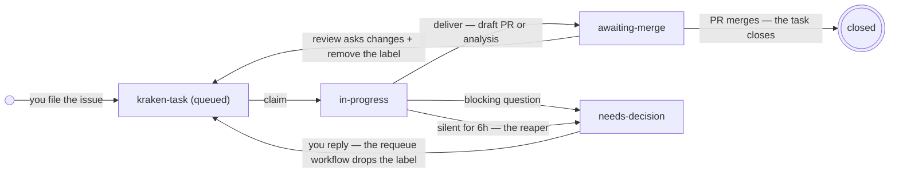

#  Kraken

[](https://github.com/rafael-adcp/kraken/releases)
[](LICENSE)

> **You set the targets; the tentacles devour them. Unleash the Kraken.**
>
> One head, many tentacles — a task queue built on **GitHub Issues** where
> named Claude Code workers claim tasks, execute them, and record the evidence.
> Write the list once; the tentacles do the rest.
>
> GitHub does the tracking. Claude Code does the coding. **Kraken is just the
> [protocol](PROTOCOL.md) between them** — it ships nothing you have to operate.

## Why?

Kraken treats AI coding prompts the way a CI server treats builds: you push
them onto a queue (GitHub Issues), a pool of named workers (tentacles) picks them up, and the issue timeline tells you what happened.

AI coding agents made each change cheap — but you are still the bus between the task list and the terminals. You can only watch so many spinners, juggle so many windows, and stay awake so many hours before something gets dropped. Kraken removes you from the loop and replaces infrastructure with things that already exist:

| Concern            | Kraken's answer                                             |
| ------------------ | ----------------------------------------------------------- |
| Queue & state      | GitHub Issues in a private coordination repo you own        |
| Claiming (no race) | Label + `claimed-by` comment; server-side ordering wins     |
| Dependencies       | Native `blocked-by` relationships — closing a task unblocks |
| Parallelism        | Capacity = how many workers you launch; 1 task per worker   |
| Dead workers       | Heartbeat comments + an hourly reaper workflow              |
| Dashboard          | The GitHub UI — filters, notifications, mobile app          |
| Audit trail        | The issue timeline: who, when, why, validated how           |

Work repos can live **anywhere** (GitHub, GitLab, private servers) — only the
coordination repo needs to be on GitHub, and it holds issues, never code.

Wondering how this differs from Copilot's coding agent, Claude's cloud agents,
or `claude-code-action` in CI? The honest side-by-side — including when to
prefer them — is [Why not just use X?](#why-not-just-use-x).

## Install (Claude Code plugin)

Zero to a draining queue in four commands:

```
/plugin marketplace add rafael-adcp/kraken
/plugin install kraken@kraken
/kraken:init OWNER/tasks --project my_app          # stand up the queue (once)
                                                   # ...file task issues, then:
/kraken:unleash OWNER/tasks --worker-name env-1 --project my_app
```

> Each command in context — environments, permissions, parallelism — is
> [the full walkthrough](#the-full-walkthrough) below.

**Requirements**: `git`, and a `gh` CLI from June 2026 or later — the dependency
flags (`--add-blocked-by` / `--blocked-by`) shipped then. Older `gh` still works for
everything else; set dependencies via the Relationships sidebar instead.

Three skills ship in the box:

| Skill              | Role                                                                                                                     |
| ------------------ | ------------------------------------------------------------------------------------------------------------------------ |
| `/kraken:init`     | The bootstrap — stands up a coordination repo: private repo, templates, canonical labels                                 |
| `/kraken:unleash`  | The worker — claims one task at a time, executes, validates, delivers a draft PR; then lurks behind a zero-token watcher |
| `/kraken:status`   | The console — review + decision queues, what's in flight with PR links, and ready-to-paste `unleash` launch lines        |

## Concepts

Five nouns do all the work in Kraken. Keep them straight and the rest follows:

| Concept | What it is | What it is *not* | Lives on |
| --- | --- | --- | --- |
| **Coordination repo** | The kraken's head — a private repo whose **Issues are the queue**; also holds the labels (the state machine), the reaper workflow, and the dependency graph | A place for code — it holds none | **GitHub** (required) |
| **Work repo** | Where the code lives; workers push branches + open draft PRs here | The queue — it holds no tasks | **Anywhere** (GitHub, GitLab, private) |
| **`project:<name>` label** | A task's **canonical identity** — `--project` filters on it, and it says which prepared environment the task belongs to | Optional — a task without it is invisible to every worker | Coordination repo |
| **Worker (tentacle)** | A **named** Claude Code session draining the queue **one task at a time**, inside one prepared environment | A pool — capacity is just how many you launch | Your machine / container / clone |
| **Task** | An open Issue labeled `kraken-task` (goal, acceptance, notes) that moves `in-progress` → `awaiting-merge` / `needs-decision` | Closed until the work truly lands — the merge closes it | Coordination repo |

## How it works (10,000 ft)

```
                     YOU
                      │ file kraken-task issues
                      ▼
    ┌────────────────────────────────────┐
    │  COORDINATION REPO (GitHub Issues) │
    │  labels · reaper · dependencies    │
    └──────────────────┬─────────────────┘
                       │ claim, heartbeat, release
                       ▼
    ┌────────────────────────────────────┐
    │  TENTACLES (Claude Code workers)   │
    │  ONE task at a time · per env      │
    └──────────────────┬─────────────────┘
                       │ push branch + draft PR
                       ▼
    ┌────────────────────────────────────┐
    │  WORK REPO (GitHub, GitLab, ...)   │
    │  draft PR with Kraken-Task trailer │
    └──────────────────┬─────────────────┘
                       │
                       ▼
                     YOU
                 (review · merge)
```

### The label state machine

Four labels are the whole state machine — every transition is a label change,
which is why the GitHub UI is the dashboard and the issue timeline is the log:



Every requeue arrow lands the task back in the queue with its full thread — the
next claim inherits the whole discussion as context.

Only two transitions are ever yours: answering a decision and merging (or
bouncing) a PR. The tentacles drive everything else.

The coordination contract — task shape, state machine, machine-readable comment
lines, the claim algorithm — is normatively specified in
[`PROTOCOL.md`](PROTOCOL.md) (`kraken-protocol/1`); it is agent-agnostic, so any
tool that follows it can be a tentacle on the same queue. How a Claude Code worker
executes it — subagents, the watcher, the bundled transition scripts — lives in
[`skills/unleash/SKILL.md`](skills/unleash/SKILL.md).

## The full walkthrough

1. **Create the coordination repo** (once). Running the plugin? One command stands it
   all up — verifies or creates the private repo, installs the three templates, and creates
   the canonical labels (idempotent, safe to re-run):

   ```
   /kraken:init OWNER/tasks --project YOUR_PROJECT_NAME
   ```

   <details>
   <summary>Not running the plugin? The same setup by hand</summary>

   The three assets land at `.github/ISSUE_TEMPLATE/task.yml`,
   `.github/workflows/reclaim-stale.yml`, and
   `.github/workflows/cleanup-closed.yml`:

   ```bash
   gh repo create OWNER/tasks --private --clone && cd tasks
   mkdir -p .github/ISSUE_TEMPLATE .github/workflows
   curl -sL https://raw.githubusercontent.com/rafael-adcp/kraken/main/skills/unleash/task-template.yml -o .github/ISSUE_TEMPLATE/task.yml
   curl -sL https://raw.githubusercontent.com/rafael-adcp/kraken/main/skills/unleash/reclaim-stale.yml -o .github/workflows/reclaim-stale.yml
   curl -sL https://raw.githubusercontent.com/rafael-adcp/kraken/main/skills/unleash/cleanup-closed.yml -o .github/workflows/cleanup-closed.yml
   git add -A && git commit -m "chore: kraken task template, reaper, and cleanup" && git push

   gh -R OWNER/tasks label create kraken-task
   gh -R OWNER/tasks label create in-progress
   gh -R OWNER/tasks label create needs-decision
   gh -R OWNER/tasks label create awaiting-merge
   gh -R OWNER/tasks label create "project:YOUR_PROJECT_NAME"      # one per project you'll queue
   ```

   </details>

2. **Queue the work**: one issue per task (goal, acceptance, notes). Every issue
   gets a **`project:<name>` label** (workers are scoped to one project — an
   unlabeled task is invisible to all of them) and dependencies via
   `gh issue edit <n> --add-label "project:YOUR_PROJECT_NAME" --add-blocked-by <m>`.

3. **Prepare the worker environments** — one per worker: a machine, container,
   or just a separate clone where that worker will live, with the project's
   toolchain installed, `gh` authenticated, and git configured. Workers run
   unattended, so the environment's Claude Code settings must pre-allow the
   delivery commands — a permission prompt with nobody around stalls the task.

   <details>
   <summary>Example allowlist for the working directory's <code>.claude/settings.json</code></summary>

   ```json
   {
     "permissions": {
       "allow": [
         "Bash(git add:*)",
         "Bash(git commit:*)",
         "Bash(git checkout:*)",
         "Bash(git push:*)",
         "Bash(gh -R OWNER/tasks:*)",
         "Bash(gh pr create:*)"
       ]
     }
   }
   ```

   Substitute your coordination repo in the `gh -R` line (queue operations are
   always explicit about their repo; it holds issues only, so nothing lands
   there). Extend the list with what the project's acceptance checks need
   (test runner, package manager).

   </details>

   Never pre-allow what lands work: `gh pr merge` stays deliberately off the
   list so merging keeps its ask-gate, and since an allow-list cannot tell a
   work branch from a default branch, protect the work repo's default branch
   (required review) for the hard guarantee. Merges always stay with you.
   Workers that would share test state (database, fixtures, ports) cannot
   share an environment: fully isolated environments, or one worker.

4. **Unleash the kraken** — one worker per environment you prepared. Capacity is
   decided at launch: every worker takes ONE task at a time, so a project gets
   exactly as much parallelism as the number of workers you point at it.

   ```
   # one tentacle into the "your_project_1" environment -> one worker
   /kraken:unleash OWNER/tasks --worker-name your_project_1-env-1 --project your_project_1

   # five tentacles, five isolated clones -> five workers draining your_project_2
   /kraken:unleash OWNER/tasks --worker-name data-env-1 --project your_project_2
   /kraken:unleash OWNER/tasks --worker-name data-env-2 --project your_project_2
   ```

   Workers deliver on **work branches + draft PRs** — never the default branch,
   never a merge. Branches follow each work repo's own naming convention (CI
   pipelines key on those patterns); traceability comes from commit trailers
   (`Kraken-Task: OWNER/work-tasks#12 (worker: ..., kraken@x.y.z)`).

5. **Come back to evidence**: `/kraken:status OWNER/tasks` prints both human-facing
   queues at once — the `awaiting-merge` review queue (each task with a result comment
   and a draft PR link), the `needs-decision` decision queue (questions with options +
   recommendation), plus what's still in flight and any orphan whose PR already merged
   but whose issue never closed. Scripting instead? The raw filters are
   `gh -R OWNER/tasks issue list --state open --label awaiting-merge` and the same with
   `--label needs-decision`. Merging a PR closes its task (`Closes` reference) and
   unblocks the dependents. Nothing merges without you.

## Keep it draining

An empty queue doesn't stop a worker: after the drain, `unleash` arms an
event-driven watcher — a background shell script (via Claude Code's Monitor
tool) polls the queue every 60s with a free `gh` call and wakes the worker
**only when a startable task appears** — an idle queue costs zero LLM tokens.
Each wake is an ordinary drain: same one task at a time, same claim tiebreaker.
Enqueue from anywhere (`gh issue create`, web UI, mobile app) and the worker
picks it up within a minute; the watcher lives until the session closes or you
say stop.

Want a bounded run instead — a scheduled container, a one-off drain? Pass
`--once`: drain and exit. Environments without the Monitor tool fall back to
`--once` automatically; there, a dumb timer (`/loop 15m /kraken:unleash ...
--once`) still works — it just costs one full LLM turn per fire even when the
queue is empty.

## The operator's cheat sheet

Every gesture you ever need, in one table — the tentacles handle
everything else:

| You want to...               | The gesture                                                                    | From the GitHub UI?              |
| ---------------------------- | ------------------------------------------------------------------------------ | -------------------------------- |
| Queue a task                 | Open an issue from the task template + `project:<name>` label                  | ✅ web + mobile                   |
| Chain tasks                  | `gh -R OWNER/tasks issue edit <n> --add-blocked-by <m>`                         | ✅ web — Relationships sidebar    |
| See the queues               | `/kraken:status OWNER/tasks`                                                    | ✅ filter issues by label         |
| Answer a decision            | **Reply on the issue** — the requeue workflow drops `needs-decision` for you   | ✅ web + mobile                   |
| Send work back after review  | Comment the feedback, then **remove `awaiting-merge`** (or start a line `requeue:`) | ✅ web + mobile                   |
| Land the work                | Merge the draft PR — its `Closes` line closes the task and unblocks dependents  | ✅ web + mobile                   |
| Cancel a task                | Close the issue                                                                 | ✅ web + mobile                   |
| Add capacity                 | Launch one more worker into one more prepared environment                       | ❌ a worker is a terminal session |

Everything except launching workers works from your phone — file tasks on the
commute, answer decisions from the couch, merge from anywhere.

## Witness the Depths

A real task's timeline, end to end — claim, restated goal + assumptions, the PR
delivered, the result with the acceptance check executed, and the close:

> Work happens while you don't. Queue a backlog before bed, on the commute, or before a meeting. Come back to finished branches instead of an empty editor.

> **100 tasks queued at 17:24 → 100 draft PRs + 0 needs-decision by 18:01 — zero terminals watched.** *(highest burst so far)*
> So far: 126 tasks filed, 125 PRs merged.
> Median claim → draft PR: 13.9 min in normal operation (n=25, mean 16.9, max ~46 min) — 0.4 min in burst mode (n=100), where workers stage the work before claiming.


## Why not just use X?

By 2026 the obvious reflex is "doesn't this already exist?" — assigning an issue
to an agent is native GitHub, Claude Code runs scheduled agents in the cloud, and
`claude-code-action` runs it in CI. It does exist, and for a single repo living
entirely on GitHub with nothing but the code to touch, those are simpler — reach
for them. Kraken earns its keep the moment the work needs *your* prepared
environment. Here is the honest cut against each.

**GitHub Copilot coding agent.** Assigning an issue to an agent is native GitHub,
and if the whole story lives there — one repo, no services, secrets already in
Actions — that native path is less to run than anything Kraken adds, and you
should take it. What it can't reach is a hosted sandbox's blind spot: the
worker doesn't have your local Postgres, your seeded fixtures, the private
package registry, or the toolchain pinned to a version the sandbox never ships.
Kraken's workers run in the environment *you* prepared, and its work repos can
live on GitLab or a private server while only the issue queue sits on GitHub —
so **prefer Copilot when** your code is on GitHub and the task needs nothing the
platform doesn't already give it.

**Claude Code cloud / scheduled agents.** A managed sandbox that wakes on a
schedule is genuinely zero-infra, and if the sandbox already has everything the
task touches, that convenience is the right trade — use it. Kraken's difference
is the shape of the run: instead of one agent in a sandbox you don't control,
you fan out *N named* workers, each in a distinct prepared environment, each
leaving an audit trail in its issue timeline — who claimed what, when, and how
it was validated. **Prefer the cloud agents when** you want scheduled runs with
no environment to keep and the sandbox is a fine place for the work to happen;
reach for Kraken when the work must run where your services, data, and
credentials already live, and you want to name and audit each worker.

**`claude-code-action` in CI.** Wiring the action into a pipeline is the right
answer when the trigger is genuinely event-driven — a push, a PR, a label — and
a fresh, ephemeral runner is exactly the clean context you want; nothing here
beats that, so wire it up. Kraken is for the other case: a queue you drain
unattended against long-lived services and a toolchain that would cost minutes
to rebuild on every runner. And because a tentacle speaks the agent-agnostic
[`kraken-protocol/1`](PROTOCOL.md), the queue isn't wed to one vendor's action —
any tool that follows the protocol can drain it. **Prefer `claude-code-action`
when** your automation is CI-shaped and a disposable runner is the correct
environment; prefer Kraken when the environment is the point and you want no
lock to a single runner or vendor.

## FAQ

<details>
<summary><b>Doesn't this already exist — Copilot, Claude cloud agents, CI?</b></summary>

Partly, and for a single GitHub repo with no local services those are simpler —
say so and use them. Kraken's edge is the prepared environment, GitLab/private
work repos, and a fan-out of named, audited workers. The honest side-by-side is
[Why not just use X?](#why-not-just-use-x) above.

</details>

<details>
<summary><b>A task landed in <code>needs-decision</code> — what do I do?</b></summary>

Just **reply on the issue** ("option B, go"). The coordination repo's
requeue-on-reply workflow sees a human comment (no 🐙 attribution disclaimer)
and removes `needs-decision` for you, so the task rejoins the queue and whoever
claims it inherits the full thread as context. Forgot nothing to remove — the
old "reply *and* remove the label" gesture still works if you prefer, and
removing the label by hand is always fine.

</details>

<details>
<summary><b>A review asked for changes — how does the task go back?</b></summary>

Comment the feedback and **remove `awaiting-merge`**. Unlike `needs-decision`, a
bare comment does **not** auto-requeue a delivered task — bouncing an
already-ready branch back on an "I'll merge tomorrow" would be worse than
leaving it. To requeue by comment alone, start a line with `requeue:`; otherwise
remove the label. The next claim continues on the existing branch with the whole
discussion in hand.

</details>

<details>
<summary><b>A worker died mid-task — is the queue stuck?</b></summary>

No. Workers heartbeat with progress comments, and the coordination repo's reaper
workflow drags any `in-progress` issue that has been silent for 6h to
`needs-decision` for you to triage — relaunch or investigate.

</details>

<details>
<summary><b>A worker hit the Claude usage limit mid-task — what happens?</b></summary>

Nothing corrupt, but today it costs you time. A usage limit looks to the queue like
sudden silence: the model stops mid-drain, so the claim just sits `in-progress` with no
new heartbeat — and an `in-progress` task is **held**, invisible to every worker (it is
excluded from the startable set), so nobody, not even the same worker relaunched, can
pick it up. The **reaper is the backstop**: after 6h of silence it moves the issue to
`needs-decision` with a `stale-claim:` comment. That is honest but blunt — `stale-claim:`
reads *"the worker likely died"*, which for a rate limit is a half-truth (the worker is
paused, not dead), and 6h is a long wait for a window that may reset in one.

So the operator's move is to break the hold sooner. Once the reaper has moved the task to
`needs-decision`, **remove that label** to requeue it — any worker with capacity then
claims it and continues on the existing branch, the whole thread in hand. To skip the 6h
wait, requeue by hand: on the stuck issue, **remove `in-progress`** and add nothing — with
only `kraken-task` left it is startable again (holding it in `needs-decision` would just
trade one held state for another). Then relaunch a worker — in another environment or on an
account that still has quota — and it claims the now-startable task.

Note the `SessionEnd` auto-release (see *Does anything survive closing the terminal?*) does
**not** help here: a usage limit does not end the session — the turn aborts but the session
stays open waiting for input, so `SessionEnd` never fires. The reaper remains the backstop
for a rate-limit pause, exactly as above.

</details>

<details>
<summary><b>Who can command my workers?</b></summary>

Anyone who can open issues in the coordination repo: a task is, in effect,
instructions that will execute in your worker's environment with your
credentials. Keep the repo private, keep write access yours, and remember that
task bodies are untrusted input to an agent that can push branches.

</details>

<details>
<summary><b>Does anything survive closing the terminal?</b></summary>

The queue does — it's GitHub Issues. The worker doesn't: `/kraken:unleash` and
its watcher live inside a Claude Code session. But a **graceful** exit now
self-heals: a bundled `SessionEnd` hook fires when you close the terminal or
`/exit`, and if the worker was still holding a claim it runs `release.sh` for
you — `released: <worker>` / `reason: session ended`, then drops `in-progress`,
so the task is back on the queue in seconds instead of waiting ~6h for the
reaper. That covers a graceful end only; a hard kill / crash / power loss (and a
usage-limit pause — see below) never fires `SessionEnd`, so the **reaper stays
the backstop** for hard death. Headless drivers (system cron, GitHub Actions)
are the natural next step for surviving the terminal entirely — see the
alternatives table in
[#32](https://github.com/rafael-adcp/kraken/issues/32).

</details>

<details>
<summary><b>How do I update the plugin?</b></summary>

`/plugin marketplace update kraken`. The plugin is pinned to the version in its
manifest — pushes to `main` reach nobody until a release bumps it, so what you
run is always a deliberate release.

</details>

<details>
<summary><b>What does uninstalling leave behind?</b></summary>

Nothing that runs. `/plugin uninstall kraken@kraken` removes the skills — the
only thing Kraken ever installs on a machine. The queue is just a private repo
of issues you own (the reaper and cleanup workflows live inside it): keep it,
archive it, or delete it. No service to stop, no daemon to kill, no state
anywhere else.

</details>

## Contributing

Kraken is a small, protocol-first tool. The spec ([`PROTOCOL.md`](PROTOCOL.md))
wins on any disagreement, the skills are prompts, and the scripts are the
mechanics. Dev setup, PR conventions, the release flow, and where design
discussion happens are all in [`CONTRIBUTING.md`](CONTRIBUTING.md); what changed
between versions lives in [`CHANGELOG.md`](CHANGELOG.md).

## Origins

Distilled from [orch-ai-orchestrator](https://github.com/rafael-adcp/orch-ai-orchestrator):
same architecture — queue, worker pool, verdicts, heartbeats, audit trail — but zero
infrastructure to operate. GitHub is the queue, the dashboard, and the log.
