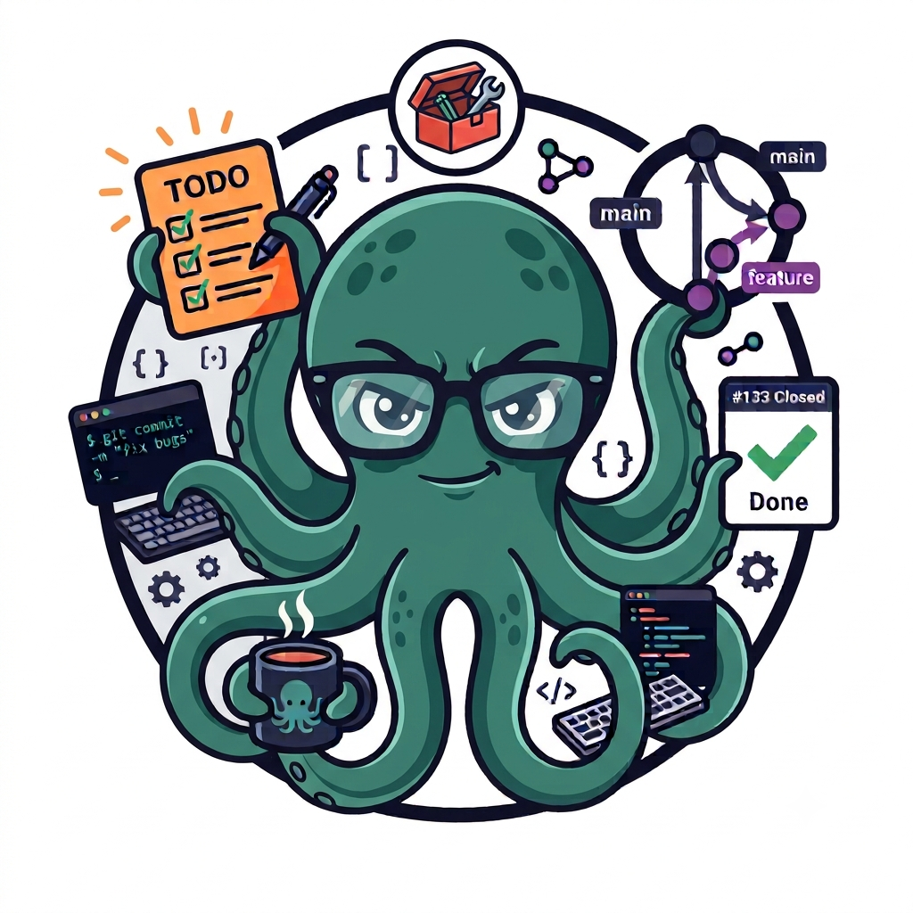
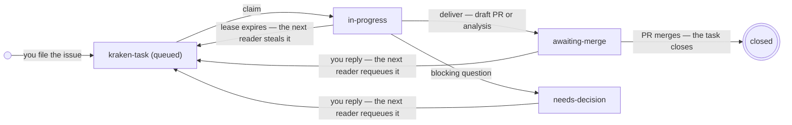
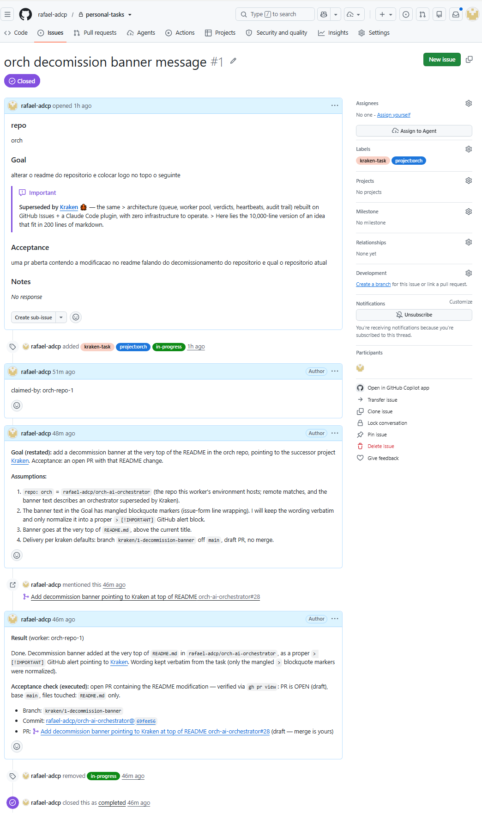

#  Kraken

[](https://github.com/rafael-adcp/kraken/releases)
[](LICENSE)

> **You set the targets; the tentacles devour them. Unleash the Kraken.**
>
> One head, many tentacles — a task queue built on **GitHub Issues** where
> named agent workers (Claude Code, GitHub Copilot CLI, or any tool that follows
> the [protocol](PROTOCOL.md)) claim tasks, execute them, and record the evidence.
> Write the list once; the tentacles do the rest.
>
> GitHub does the tracking. Your coding agent does the coding. **Kraken is just the
> [protocol](PROTOCOL.md) between them** — it ships nothing you have to operate.

## In 30 seconds

**What it is.** A task queue for AI coding agents, where the queue is GitHub
Issues in a private repo you own. You write tasks; named agent workers claim
them one at a time, do the work in *your* prepared environment, and open draft
PRs. You review and merge.

**What you run.**

```
/plugin marketplace add rafael-adcp/kraken
/plugin install kraken@kraken
/kraken:init OWNER/tasks --project my_app                 # once
/kraken:unleash OWNER/tasks --worker-name env-1 --project my_app
```

Launch that last line in *N* terminals and you have *N* workers. There is no
server, no database, no daemon — the coordination state is issue labels plus a
git ref, and the dashboard is the GitHub UI you already have.

**Why it might be for you.** You have more agent-sized tasks than attention:
you're the bus between a task list and a row of terminals, and things get
dropped. Kraken takes you out of that loop without moving your work off the
machine where your services, data and credentials already live.

**Why it might not be.** If your code is on GitHub and the task needs nothing
your platform doesn't already give it, Copilot's coding agent or
`claude-code-action` in CI is less to run — see [Why not just use
X?](#why-not-just-use-x) for the honest cut.

Everything below is detail. The [walkthrough](#the-full-walkthrough) is the
next stop if you want to run it; [`PROTOCOL.md`](PROTOCOL.md) is the spec if
you want to build a worker, and [`HISTORY.md`](HISTORY.md) is how that spec got
the shape it has.

## Why?

Kraken treats AI coding prompts the way a CI server treats builds: you push
them onto a queue (GitHub Issues), a pool of named workers (tentacles) picks them up, and the issue timeline tells you what happened.

AI coding agents made each change cheap — but you are still the bus between the task list and the terminals. You can only watch so many spinners, juggle so many windows, and stay awake so many hours before something gets dropped. Kraken removes you from the loop and replaces infrastructure with things that already exist:

| Concern            | Kraken's answer                                             |
| ------------------ | ----------------------------------------------------------- |
| Queue & state      | GitHub Issues in a private coordination repo you own        |
| Claiming (no race) | Atomic compare-and-swap on a git ref — one creator wins, HTTP 422 to the rest |
| Dependencies       | Native `blocked-by` relationships — closing a task unblocks |
| Parallelism        | Capacity = how many workers you launch; 1 task per worker   |
| Dead workers       | The claim is a **lease** (30 min, renewed as you work); stop renewing and the next worker to read the queue takes the task over |
| Bad tasks          | The issue form requires Goal + Acceptance; `status` reports what a worker still cannot start |
| Dashboard          | The GitHub UI — filters, notifications, mobile app          |
| Audit trail        | The issue timeline: who, when, why, validated how           |

Work repos can live **anywhere** (GitHub, GitLab, private servers) — only the
coordination repo needs to be on GitHub, and it holds issues, never code.

Wondering how this differs from Copilot's coding agent, Claude's cloud agents,
or `claude-code-action` in CI? The honest side-by-side — including when to
prefer them — is [Why not just use X?](#why-not-just-use-x).

## Install

Both agents install from the **same marketplace** — Copilot CLI reads the Claude
Code plugin format, so the same commands work.

### Claude Code (plugin)

Zero to a draining queue in four commands:

```
/plugin marketplace add rafael-adcp/kraken
/plugin install kraken@kraken
/kraken:init OWNER/tasks --project my_app          # stand up the queue (once)
                                                   # ...file task issues, then:
/kraken:unleash OWNER/tasks --worker-name env-1 --project my_app
```

### GitHub Copilot CLI

Same plugin, same commands — Copilot CLI reads the Claude Code plugin format and
loads its three skills:

```
/plugin marketplace add rafael-adcp/kraken
/plugin install kraken@kraken
```

> Each command in context — environments, permissions, parallelism — is
> [the full walkthrough](#the-full-walkthrough) below.

**Requirements**: `git`, and a `gh` CLI from June 2026 or later — the dependency
flags (`--add-blocked-by` / `--blocked-by`) shipped then. Older `gh` still works for
everything else; set dependencies via the Relationships sidebar instead.

Three skills ship in the box:

| Skill              | Role                                                                                                                     |
| ------------------ | ------------------------------------------------------------------------------------------------------------------------ |
| `/kraken:init`     | The bootstrap — stands up a coordination repo: private repo, templates, canonical labels                                 |
| `/kraken:unleash`  | The worker — claims one task at a time, executes, validates, delivers a draft PR; then lurks behind a zero-token watcher |
| `/kraken:status`   | The console — review + decision queues, what's in flight with PR links, and ready-to-paste `unleash` launch lines        |

## Concepts

Five nouns do all the work in Kraken. Keep them straight and the rest follows:

| Concept | What it is | What it is *not* | Lives on |
| --- | --- | --- | --- |
| **Coordination repo** | The kraken's head — a private repo whose **Issues are the queue**; also holds the labels (the state machine), the claim refs, and the dependency graph | A place for code — it holds none | **GitHub** (required) |
| **Work repo** | Where the code lives; workers push branches + open draft PRs here | The queue — it holds no tasks | **Anywhere** (GitHub, GitLab, private) |
| **`project:<name>` label** | A task's **canonical identity** — `--project` filters on it, and it says which prepared environment the task belongs to | Optional — a task without it is invisible to every worker | Coordination repo |
| **Worker (tentacle)** | A **named** agent session (Claude Code, Copilot CLI, ...) draining the queue **one task at a time**, inside one prepared environment | A pool — capacity is just how many you launch | Your machine / container / clone |
| **Task** | An open Issue labeled `kraken-task` (goal, acceptance, notes) that moves `in-progress` → `awaiting-merge` / `needs-decision` | Closed until the work truly lands — the merge closes it | Coordination repo |

## How it works (10,000 ft)

```
                     YOU
                      │ file kraken-task issues
                      ▼
    ┌────────────────────────────────────┐
    │  COORDINATION REPO (GitHub Issues) │
    │  labels · claim refs · dependencies│
    └──────────────────┬─────────────────┘
                       │ claim, renew, release
                       ▼
    ┌────────────────────────────────────┐
    │  TENTACLES (agent workers)         │
    │  ONE task at a time · per env      │
    └──────────────────┬─────────────────┘
                       │ push branch + draft PR
                       ▼
    ┌────────────────────────────────────┐
    │  WORK REPO (GitHub, GitLab, ...)   │
    │  draft PR with Kraken-Task trailer │
    └──────────────────┬─────────────────┘
                       │
                       ▼
                     YOU
                 (review · merge)
```

### The label state machine

Four labels are the whole state machine — every transition is a label change,
which is why the GitHub UI is the dashboard and the issue timeline is the log:


```mermaid
flowchart LR
    S((" ")) -->|you file the issue| Q["kraken-task (queued)"]
    Q -->|claim| P[in-progress]
    P -->|deliver — draft PR or analysis| M[awaiting-merge]
    P -->|blocking question| D[needs-decision]
    P -->|lease expires — the next reader steals it| Q
    D -->|you reply — the next reader requeues it| Q
    M -->|you reply — the next reader requeues it| Q
    M -->|PR merges — the task closes| E(((closed)))
```

Every requeue arrow lands the task back in the queue with its full thread — the
next claim inherits the whole discussion as context.

Only two transitions are ever yours: answering a decision and merging (or
bouncing) a PR. The tentacles drive everything else.

The coordination contract — task shape, state machine, the machine marker,
the claim algorithm — is normatively specified in
[`PROTOCOL.md`](PROTOCOL.md) (`kraken-protocol/8`); it is agent-agnostic, so any
tool that follows it can be a tentacle on the same queue. How a worker executes it
lives in [`skills/unleash/SKILL.md`](skills/unleash/SKILL.md) — a loop around
`kraken.py next-action`, which answers "what do I do now" with a JSON envelope so
the ordering rules are the program's job rather than something the agent has to
remember. That makes the skill harness-neutral: the GitHub Copilot CLI worker
reuses it through [`AGENTS.md`](AGENTS.md) with **no deltas at all**.

## The full walkthrough

1. **Create the coordination repo** (once). Running the plugin? One command stands it
   all up — verifies or creates the private repo, installs the task template and its four
   coordination workflows, and creates
   the canonical labels (idempotent, safe to re-run):

   ```
   /kraken:init OWNER/tasks --project YOUR_PROJECT_NAME
   ```

   <details>
   <summary>Not running the plugin? The same setup by hand</summary>

   **One file.** Under `kraken-protocol/8` the coordination repo runs nothing —
   no workflows, and no vendored copy of the transition program for them to
   exec. Stale claims, an answered task's requeue and queue-entry validation are
   all derived by the reader, on the queue read a worker or `status` performs
   anyway (PROTOCOL.md §2.1, §6). You do not need GitHub Actions enabled on this
   repo at all.

   ```bash
   gh repo create OWNER/tasks --private --clone && cd tasks
   mkdir -p .github/ISSUE_TEMPLATE
   curl -sL https://raw.githubusercontent.com/rafael-adcp/kraken/main/skills/unleash/task-template.yml -o .github/ISSUE_TEMPLATE/task.yml
   git add -A && git commit -m "chore: kraken task template" && git push

   gh -R OWNER/tasks label create kraken-task
   gh -R OWNER/tasks label create in-progress
   gh -R OWNER/tasks label create needs-decision
   gh -R OWNER/tasks label create awaiting-merge
   gh -R OWNER/tasks label create priority:high                    # optional — jumps the startable queue
   gh -R OWNER/tasks label create "project:YOUR_PROJECT_NAME"      # one per project you'll queue
   ```

   </details>

2. **Queue the work**: one issue per task (goal, acceptance, notes). Every issue
   gets a **`project:<name>` label** (workers are scoped to one project — an
   unlabeled task is invisible to all of them) and dependencies via
   `gh issue edit <n> --add-label "project:YOUR_PROJECT_NAME" --add-blocked-by <m>`.
   Add the optional **`priority:high`** label to jump a task to the front of the
   startable queue — workers claim high-priority tasks before older normal ones,
   with `createdAt` FIFO still ordering each tier.

3. **Prepare the worker environments** — one per worker: a machine, container,
   or just a separate clone where that worker will live, with the project's
   toolchain installed, `gh` authenticated, and git configured. Workers run
   unattended, so the environment's agent settings must pre-allow the
   delivery commands — a permission prompt with nobody around stalls the task.
   (Copilot's equivalent is launching with `--allow-all-tools --no-ask-user`.)

   <details>
   <summary>Example allowlist for the working directory's <code>.claude/settings.json</code></summary>

   ```json
   {
     "permissions": {
       "allow": [
         "Bash(git add:*)",
         "Bash(git commit:*)",
         "Bash(git checkout:*)",
         "Bash(git push:*)",
         "Bash(gh -R OWNER/tasks:*)",
         "Bash(gh pr create:*)"
       ]
     }
   }
   ```

   Substitute your coordination repo in the `gh -R` line (queue operations are
   always explicit about their repo; it holds issues only, so nothing lands
   there). Extend the list with what the project's acceptance checks need
   (test runner, package manager).

   </details>

   Never pre-allow what lands work: `gh pr merge` stays deliberately off the
   list so merging keeps its ask-gate, and since an allow-list cannot tell a
   work branch from a default branch, protect the work repo's default branch
   (required review) for the hard guarantee. Merges always stay with you.
   Workers that would share test state (database, fixtures, ports) cannot
   share an environment: fully isolated environments, or one worker.

4. **Unleash the kraken** — one worker per environment you prepared. Capacity is
   decided at launch: every worker takes ONE task at a time, so a project gets
   exactly as much parallelism as the number of workers you point at it.

   ```
   # one tentacle into the "your_project_1" environment -> one worker
   /kraken:unleash OWNER/tasks --worker-name your_project_1-env-1 --project your_project_1

   # five tentacles, five isolated clones -> five workers draining your_project_2
   /kraken:unleash OWNER/tasks --worker-name data-env-1 --project your_project_2
   /kraken:unleash OWNER/tasks --worker-name data-env-2 --project your_project_2
   ```

   Workers deliver on **work branches + draft PRs** — never the default branch,
   never a merge. Branches follow each work repo's own naming convention (CI
   pipelines key on those patterns); traceability comes from commit trailers
   (`Kraken-Task: OWNER/work-tasks#12 (worker: ..., kraken@x.y.z)`).

5. **Come back to evidence**: `/kraken:status OWNER/tasks` prints both human-facing
   queues at once — the `awaiting-merge` review queue (each task with a result comment
   and a draft PR link), the `needs-decision` decision queue (questions with options +
   recommendation), plus what's still in flight and any orphan whose PR already merged
   but whose issue never closed. Scripting instead? The raw filters are
   `gh -R OWNER/tasks issue list --state open --label awaiting-merge` and the same with
   `--label needs-decision`. Merging a PR closes its task (`Closes` reference) and
   unblocks the dependents. Nothing merges without you.

## Keep it draining

An empty queue doesn't stop a worker: after the drain, `unleash` arms an
event-driven watcher — a background shell script (via Claude Code's Monitor
tool) polls the queue every 60s with a free `gh` call and wakes the worker
**only when a startable task appears** — an idle queue costs zero LLM tokens.
Each wake is an ordinary drain: same one task at a time, same claim-ref CAS.
Enqueue from anywhere (`gh issue create`, web UI, mobile app) and the worker
picks it up within a minute; the watcher lives until the session closes or you
say stop. A watcher that can no longer *read* the queue (expired token, dead
network, revoked access) says so on stderr instead of impersonating an idle
queue, and gives up with exit `20` after 60 consecutive failed reads
(`KRAKEN_WATCH_MAX_FAILURES`) — a dead monitor entry you can see, rather than a
live one that wakes nobody.

Want a bounded run instead — a scheduled container, a one-off drain? Pass
`--once`: drain and exit. Environments without the Monitor tool fall back to
`--once` automatically; there, a dumb timer (`/loop 15m /kraken:unleash ...
--once`) still works — it just costs one full LLM turn per fire even when the
queue is empty.

For the GitHub Copilot CLI worker (no Monitor tool), the shipped
[`scripts/kraken-loop.sh`](scripts/kraken-loop.sh) is the ready-made ambush loop:
run it from a kraken checkout and it polls the queue outside the model, invoking
`copilot` only when a task is actually startable — the same zero-token idle
behavior as the Monitor watcher, without copying anything out of a session folder.

```
scripts/kraken-loop.sh OWNER/tasks --worker-name env-1 --project my_app
```

## The operator's cheat sheet

Every gesture you ever need, in one table — the tentacles handle
everything else:

| You want to...               | The gesture                                                                    | From the GitHub UI?              |
| ---------------------------- | ------------------------------------------------------------------------------ | -------------------------------- |
| Queue a task                 | Open an issue from the task template + `project:<name>` label                  | ✅ web + mobile                   |
| Chain tasks                  | `gh -R OWNER/tasks issue edit <n> --add-blocked-by <m>`                         | ✅ web — Relationships sidebar    |
| See the queues               | `/kraken:status OWNER/tasks`                                                    | ✅ filter issues by label         |
| Answer a decision            | **Reply on the issue** — the next worker to read the queue picks it up again   | ✅ web + mobile                   |
| Send work back after review  | **Comment the feedback** — the next worker to read the queue picks it up again  | ✅ web + mobile                   |
| Land the work                | Merge the draft PR — its `Closes` line closes the task and unblocks dependents  | ✅ web + mobile                   |
| Cancel a task                | Close the issue                                                                 | ✅ web + mobile                   |
| Add capacity                 | Launch one more worker into one more prepared environment                       | ❌ a worker is a terminal session |

Everything except launching workers works from your phone — file tasks on the
commute, answer decisions from the couch, merge from anywhere.

## Witness the Depths

A real task's timeline, end to end — claim, restated goal + assumptions, the PR
delivered, the result with the acceptance check executed, and the close:

> Work happens while you don't. Queue a backlog before bed, on the commute, or before a meeting. Come back to finished branches instead of an empty editor.

> **100 tasks queued at 17:24 → 100 draft PRs + 0 needs-decision by 18:01 — zero terminals watched.** *(highest burst so far)*
> So far: 126 tasks filed, 125 PRs merged.
> Median claim → draft PR: 13.9 min in normal operation (n=25, mean 16.9, max ~46 min) — 0.4 min in burst mode (n=100), where workers stage the work before claiming.



## Why not just use X?

| Alternative | Coordination primitive | Infra required | Agent-agnostic | Prefer it when |
| --- | --- | --- | --- | --- |
| **GitHub Copilot coding agent** | Issue assignment (native GitHub) | Hosted sandbox; nothing beyond GitHub Actions | No | Code is on GitHub and the task needs nothing the platform doesn't already give it |
| **Claude Code cloud / scheduled agents** | A schedule waking a managed sandbox | Zero — the sandbox is managed for you | No | You want scheduled runs with no environment to keep and the sandbox suits the work |
| **`claude-code-action` in CI** | An event trigger (push / PR / label) | Ephemeral, disposable CI runner | No | Automation is CI-shaped and a fresh runner is the correct environment |
| **Kraken** | An issue queue drained via [`kraken-protocol/8`](PROTOCOL.md) | Your prepared, long-lived environment | Yes | The environment is the point — work must run where your services, data, and credentials already live, with named, audited workers |

By 2026 the obvious reflex is "doesn't this already exist?" — assigning an issue
to an agent is native GitHub, Claude Code runs scheduled agents in the cloud, and
`claude-code-action` runs it in CI. It does exist, and for a single repo living
entirely on GitHub with nothing but the code to touch, those are simpler — reach
for them. Kraken earns its keep the moment the work needs *your* prepared
environment. Here is the honest cut against each.

**GitHub Copilot coding agent.** Assigning an issue to an agent is native GitHub,
and if the whole story lives there — one repo, no services, secrets already in
Actions — that native path is less to run than anything Kraken adds, and you
should take it. What it can't reach is a hosted sandbox's blind spot: the
worker doesn't have your local Postgres, your seeded fixtures, the private
package registry, or the toolchain pinned to a version the sandbox never ships.
Kraken's workers run in the environment *you* prepared, and its work repos can
live on GitLab or a private server while only the issue queue sits on GitHub —
so **prefer Copilot when** your code is on GitHub and the task needs nothing the
platform doesn't already give it.

**Claude Code cloud / scheduled agents.** A managed sandbox that wakes on a
schedule is genuinely zero-infra, and if the sandbox already has everything the
task touches, that convenience is the right trade — use it. Kraken's difference
is the shape of the run: instead of one agent in a sandbox you don't control,
you fan out *N named* workers, each in a distinct prepared environment, each
leaving an audit trail in its issue timeline — who claimed what, when, and how
it was validated. **Prefer the cloud agents when** you want scheduled runs with
no environment to keep and the sandbox is a fine place for the work to happen;
reach for Kraken when the work must run where your services, data, and
credentials already live, and you want to name and audit each worker.

**`claude-code-action` in CI.** Wiring the action into a pipeline is the right
answer when the trigger is genuinely event-driven — a push, a PR, a label — and
a fresh, ephemeral runner is exactly the clean context you want; nothing here
beats that, so wire it up. Kraken is for the other case: a queue you drain
unattended against long-lived services and a toolchain that would cost minutes
to rebuild on every runner. And because a tentacle speaks the agent-agnostic
[`kraken-protocol/8`](PROTOCOL.md), the queue isn't wed to one vendor's action —
any tool that follows the protocol can drain it. **Prefer `claude-code-action`
when** your automation is CI-shaped and a disposable runner is the correct
environment; prefer Kraken when the environment is the point and you want no
lock to a single runner or vendor.

## FAQ

<details>
<summary><b>Doesn't this already exist — Copilot, Claude cloud agents, CI?</b></summary>

Partly, and for a single GitHub repo with no local services those are simpler —
say so and use them. Kraken's edge is the prepared environment, GitLab/private
work repos, and a fan-out of named, audited workers. The honest side-by-side is
[Why not just use X?](#why-not-just-use-x) above.

</details>

<details>
<summary><b>A task landed in <code>needs-decision</code> — what do I do?</b></summary>

Just **reply on the issue** ("option B, go"). Nothing else: a reply newer than
the task's last 🐙 comment *is* the requeue — every worker derives it on the read
(PROTOCOL.md §6), so the task rejoins the queue immediately and whoever claims it
inherits the full thread as context. The `needs-decision` label stays until that
worker claims it and swaps it off; nothing reads it in the meantime. The old
"reply *and* remove the label" gesture still works if you prefer.

</details>

<details>
<summary><b>A review asked for changes — how does the task go back?</b></summary>

Just **reply on the issue** — exactly the same gesture as answering a decision.
A comment newer than the task's last 🐙 comment *is* the requeue, in **both** held
states (PROTOCOL.md §6), so the task rejoins the queue and the next claim
continues on the existing branch with the whole discussion in hand. Removing
`awaiting-merge` by hand still works if you prefer.

The flip side, on purpose: a comment that is *not* a work request ("nice, thanks")
also requeues. If the branch is ready and you have nothing to ask for, the gesture
is **merge it**, not comment on it — and a worker that picks the task back up and
finds nothing actionable in your comment escalates instead of guessing, so the
worst case is a question on the thread rather than a silent bounce.

</details>

<details>
<summary><b>How do I find tasks no worker will ever start?</b></summary>

Run **`/kraken:status`** — it ends with a **🧹 Queue hygiene** section listing
every open task missing a `project:<name>` label (so no worker will ever see it)
or an empty **Goal**/**Acceptance** (so a worker claims it and stalls). It costs
nothing extra: `status` already reads every open task's labels and body.

The issue form catches most of this at the source — Goal and Acceptance are
`required` fields, so a blank one never becomes an issue. What the form cannot do
is apply the `project:` label, which is exactly what hygiene is there for. A
project-less task is reported even under `--project`: it belongs to no project,
so a scope would bury the one failure you most need to see. It **informs** —
nothing is blocked, closed, or relabelled.

</details>

<details>
<summary><b>A worker died mid-task — is the queue stuck?</b></summary>

No, and you don't have to do anything. A claim is a **lease**: the worker holds
it by renewing its claim ref every few minutes while it works, and the ref's
commit date is the clock. Stop renewing — crash, kill, closed laptop, dead
container — and the lease **expires 30 minutes later**. The next worker to read
the queue sees an expired lease, takes the task over (leaving a note saying it
did), and carries on from the existing branch and thread. No cron, nothing
installed in the coordination repo, and the same behaviour in every harness.

The dead worker cannot come back and stomp on it either: every write it might
attempt — deliver, escalate, release, even its next renewal — first checks the
lease is still its own, and refuses if it is not.

You only hear about it if a task defeats **three** workers in a row: at that
point stealing it again would just burn a fourth, so it goes to
`needs-decision` for you to triage. (The same read also cleans up after itself:
a lock left on a task that already moved on is deleted.)

Want a different clock? `KRAKEN_LEASE_TTL_SECONDS` sets the TTL; the renewal
interval is always a third of it (`kraken.py contract lease-renew`).

</details>

<details>
<summary><b>A worker hit the Claude usage limit mid-task — what happens?</b></summary>

It self-heals. A usage limit kills the **turn**, not the session: the model stops
mid-drain and the session sits open waiting for input, so the `SessionEnd`
auto-release never fires. What does fire is Claude Code's **`StopFailure`** hook
(a turn ended by an API error), and Kraken registers it with matcher
`rate_limit`: the bundled hook **releases the held claim on the spot** — a
`released` marker with `reason: usage limit` and the claim ref deleted — so the task is
back on the queue in seconds instead of sitting on a lease nobody is renewing, free for any
worker on an account that still has quota. (`gh` still works at limit time;
only the model API is blocked, which is why the release can land.)

Retry is automatic too. The same hook stamps a local **wake-retry flag**, and
the armed watcher re-emits its wake whenever the flag proves the previous wake's
turn died (spaced by `KRAKEN_WATCH_RETRY_SECONDS`, default 5 min): while the
limit lasts each retry fails for free, and the first one after the window resets
wakes the worker, which re-claims the task and continues on the existing branch
with the whole thread in hand. No operator gesture needed.

The lease is the backstop for the residue — the hook itself failing, or a hard
kill: 30 minutes without a renewal and the task is free for the next worker
regardless, no hook involved. (Removing the `in-progress` label by hand does
*nothing* here — it's a badge for you, not the lock. The lock is the claim ref,
and only the lease's clock or an explicit release opens it.)

</details>

<details>
<summary><b>Who can command my workers?</b></summary>

Anyone who can open issues in the coordination repo: a task is, in effect,
instructions that will execute in your worker's environment with your
credentials. Keep the repo private, keep write access yours, and remember that
task bodies are untrusted input to an agent that can push branches.

</details>

<details>
<summary><b>Does anything survive closing the terminal?</b></summary>

The queue does — it's GitHub Issues. The worker doesn't: `/kraken:unleash` and
its watcher live inside a Claude Code session. But a **graceful** exit now
self-heals: a bundled `SessionEnd` hook fires when you close the terminal or
`/exit`, and if the worker was still holding a claim it runs `kraken.py release`
for you — `released: <worker>` / `reason: session ended`, then drops `in-progress`,
so the task is back on the queue in seconds instead of at the end of its lease.
That covers a graceful end only; a usage-limit pause never fires `SessionEnd`
either, but its own `StopFailure` hook releases the claim there (see the limit
FAQ above). A hard kill / crash / power loss fires neither hook — and it does not
matter: the **lease expires on its own** 30 minutes later and the next worker to
read the queue takes the task over (§5). The hooks only make that immediate; no
server-side job, so it needs nothing running anywhere. And the watcher is no
escape hatch: it is armed by `unleash` itself (its *Staying in ambush* step),
inside the same session — not a command of its own — so it dies with it. Moving the poll out of the model is
what [`scripts/kraken-loop.sh`](scripts/kraken-loop.sh) already does, though it
still needs a live shell to run in; a genuinely headless driver (system cron,
GitHub Actions) is open work —
[#57](https://github.com/rafael-adcp/kraken/issues/57).

</details>

<details>
<summary><b>Is the Copilot CLI worker as self-healing as the Claude Code one?</b></summary>

Yes — and under `kraken-protocol/8` that includes recovery **latency**, which is
the part that used to differ. A claim is a **lease** that expires 30 minutes
after its last renewal, and expiry is applied by whoever reads the queue. So a
worker that dies in any harness, in any way, frees its task within one TTL with
nothing installed. The bundled `SessionEnd`/`StopFailure` hooks are **Claude Code
hook events** and still never fire around a `copilot` process — they are now an
optimization (seconds instead of minutes), not the mechanism.

[`scripts/kraken-loop.sh`](scripts/kraken-loop.sh) carries the same optimization
for Copilot: `kraken.py claim` records the open claim in
`~/.kraken/claim-<worker>.json` and every terminal transition
(deliver/escalate/release) removes it, so when the `copilot` process exits with
that file still present the drain provably died holding the lease — crash, kill,
or a rate-limit abort — and the loop runs `kraken.py release` on the spot. Its
exit/Ctrl-C trap does the same when the loop itself is stopped mid-drain. The
release is scoped to the loop's own `--worker-name`, and `release` refuses (exit
10) on a lease that is no longer this worker's, so a co-located or successor
worker's live lease is never touched.

A **bare** `copilot -p …` invocation outside the loop is therefore no longer a
correctness gap, just a slower one: its task comes back in minutes rather than
seconds — exactly like a hard kill / power loss on either harness. Run it
through the loop anyway: it also skips the model entirely on an idle queue.

</details>

<details>
<summary><b>How do I update the plugin?</b></summary>

`/plugin marketplace update kraken`. The plugin is pinned to the version in its
manifest — pushes to `main` reach nobody until a release bumps it, so what you
run is always a deliberate release.

</details>

<details>
<summary><b>What does uninstalling leave behind?</b></summary>

Nothing that runs. `/plugin uninstall kraken@kraken` removes the skills — the
only thing Kraken ever installs on a machine. The queue is just a private repo
of issues you own, with nothing running inside it: keep it,
archive it, or delete it. No service to stop, no daemon to kill, no state
anywhere else.

</details>

## Contributing

Kraken is a small, protocol-first tool. The spec ([`PROTOCOL.md`](PROTOCOL.md))
wins on any disagreement, the skills are prompts, and `kraken.py` is the
mechanics. Dev setup, PR conventions, the release flow, and where design
discussion happens are all in [`CONTRIBUTING.md`](CONTRIBUTING.md); what changed
between versions lives in the [GitHub
Releases](https://github.com/rafael-adcp/kraken/releases).

## Origins

Distilled from [orch-ai-orchestrator](https://github.com/rafael-adcp/orch-ai-orchestrator):
same architecture — queue, worker pool, verdicts, heartbeats, audit trail — but zero
infrastructure to operate. GitHub is the queue, the dashboard, and the log.
